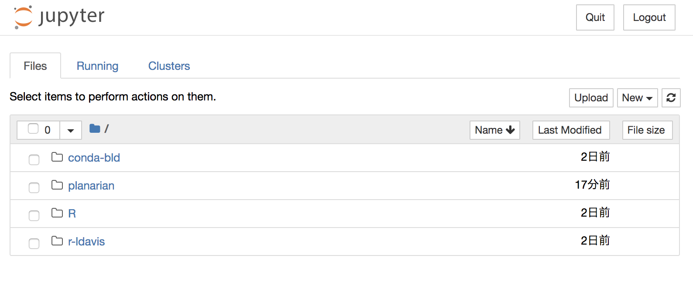
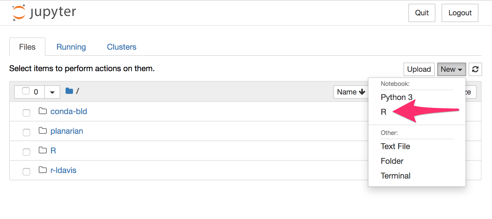
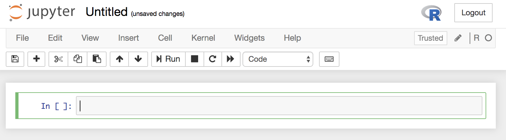

# 午後の実習：シングルセルRNA-seq解析


## 今日は何をやるの？


- プラナリアの scRNA-seq データ解析
    - https://www.ncbi.nlm.nih.gov/geo/query/acc.cgi?acc=GSE115280
    - [1] 51562  2001
    - cluster markers https://figshare.com/articles/Additional_file_4/6852896
    - https://genomebiology.biomedcentral.com/articles/10.1186/s13059-018-1498-x

元論文: 
- Comparative transcriptomic analyses and single-cell RNA sequencing of the freshwater planarian Schmidtea mediterranea identify major cell types and pathway conservation https://genomebiology.biomedcentral.com/articles/10.1186/s13059-018-1498-x
  - freshwater planarian *Schmidtea mediterranea*
  - Drop-seq

データ: 
- https://www.ncbi.nlm.nih.gov/geo/query/acc.cgi?acc=GSE115280


# 実習

## 1. 準備
### 1-1. 計算機の準備

端末（Terminal）を開き直した人は以下のコマンドを打つ。

```
$ source activate bioinfo
```

**確認** 上のコマンドを打ったら、下↓のように左端に `(bioinfo)` がつくはず。

```
(bioinfo) ozaki.haruka.gu@ubuntu:~$
```

### 1-２. 必要なファイルをダウンロードする

```
# ホームディレクトリに移動する
$ cd

# planarian というディレクトリを作成する
$ mkdir planarian

# planarian というディレクトリへ移動する
$ cd planarian

# ダウンロードする
$ wget ftp://ftp.ncbi.nlm.nih.gov/geo/samples/GSM3173nnn/GSM3173562/suppl/GSM3173562_Lakshmipuram_NCBI_processeddata.txt.gz

# 解凍する
$ gunzip GSM3173562_Lakshmipuram_NCBI_processeddata.txt.gz
```

**確認**

```
# 行数を調べる
$ wc -l GSM3173562_Lakshmipuram_NCBI_processeddata.txt
51563 GSM3173562_Lakshmipuram_NCBI_processeddata.txt

# 中身を見てみる
$ less GSM3173562_Lakshmipuram_NCBI_processeddata.txt
```

## 2. 解析を始める
### 2-1. Jupyter の起動

下のコマンドを打って、ブラウザを開く。

```
$ cd ~/planarian
$ jupyter notebook
```

<!-- SSH接続している時用:  jupyter notebook --port=1234 --ip=0.0.0.0 --no-browser -->

ブラウザが開いたら "New" を押す↓　



R を選ぶ↓



新しい画面が開く↓




### 2-2. Jupyter の tips

<!-- `> ` はついてないけど、 -->

**Shift + Enter** でコマンドが実行できます。

## 実習

[planarian.ipynb](planarian.ipynb) を参照


<!-- # トラブルシュートの記録（実習とは関係ない）

- [x] uwot が `instal.pacakges()` でインストールできない
  - [x] install.packages ではダメ `cannot find lgomp`
  - [x] `conda install -y -c conda-forge r-uwot` → インストールできた
- [ ] Rtsne が `instal.pacakges()` でインストールできない
  - [x] `conda install -c conda-forge r-rtsne` → インストールできた
- [ ] scran を入れようとすると、 igraph が入れられなくて積む
  - [x] `conda install -y -c r r-igraph` ができるかをテスト できた
  - [ ] `conda install -y -c conda-forge r-statmod` -->